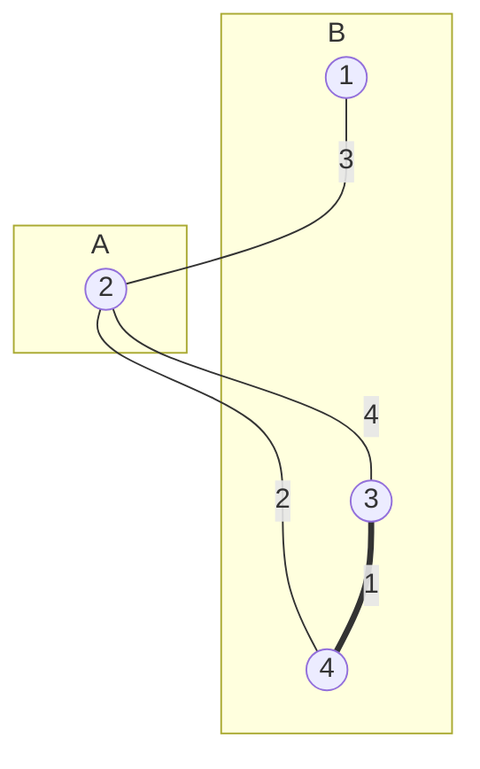

# E2-EX 危险品放置
## 题目描述
现有若干危险品需要放置在$A$，$B$两个仓库。

当两种特定的危险品放置在相同地点时即可能产生危险。我们用危险系数$\alpha_{i,j}$表示危险品$i$，$j$放置在一起的危险程度。一些危险品即使放置在一起也不会产生任何危险，此时$\alpha_{i,j}=0$，还有一些危险品即使单独放置也会产生危险，此时$\alpha_{i,i}>0$。

定义两个仓库整体的危险系数为$\max(\displaystyle \max_{i,j\in A}\alpha_{i,j},\, \displaystyle  \max_{i,j\in B}\alpha_{i,j})$，即放置在一起的所有危险品两两组合的危险系数的最大值。

现在对于一组给定的危险系数，需要设计方案使得整体危险系数最小。

## 输入格式
输入数据共$m + 1$行。

第一行两个整数$n$和$m$表示共有$n$种危险品，危险品之间的危险组合（危险系数非零的物品组合）共$m$种。

接下来的$m$行，每行三个整数$i$，$j$，$\alpha_{i,j}$，表示$(i,\,j)$为危险组合（$i$，$j$可能相等），其危险系数为$\alpha_{i,j}>0$。

## 输出格式
输出共一行，包含一个整数，表示整体危险系数的最小值。

## 数据规模：

$0 < n \leq 10^5$

$0 < m \leq 10^6$


# 解题报告
## 初始思路
由于需要将危险品放置在不相关的两个仓库中，并求危险系数最大值的最小值，考虑到我们只关注相关危险系数在分割后的最大值，目的是通过隔离相关的两个危险品删除较大的危险系数。

```c++
// 危险关系，下标是边序号 edges
struct DangerousRelation
{
    int i;     // 危险关系中的危险品 i
    int j;     // 危险关系中的危险品 j
    int alpha; // 危险系数 alpha(i,j)
} Relation[M + 1];
```

因此将各种危险品视为顶点，危险系数（包括非危险组合的零系数）视为边权，依次考虑当前最大的系数$\alpha_{i,j},\ i \neq j$，将边$\langle i,\,j \rangle$断开，**直到将图分为两个连通片即不再连通，或最大的危险系数来自于单独放置的危险品自身为止**，此时最大的危险系数即所求。

关于算法终止的条件，问题转化为一个关于图是否连通的判断，然而注意到以上设定下的这张图是一个完全图，边数为$\displaystyle \frac{n(n-1)}{2}$，而在含如此数量的边数的图中跑DFS是不可以接受的。转换思路，假设开始时顶点各自不相邻，从危险系数最小的边出发，按权值从小到大的顺序将边加入图中，并判断图是否连通，于是这里的连通性判断即可转换为**并查集问题**：每插入一条边即执行一次UNION操作，直到某次插入会使得图连通，前一条插入边的权值即满足要求。自相关情况也仅需要更新最大值即可。

完成上述设计后一个细节问题出现了，输入并不保证每一个危险品都有非零的危险关系，即可能有不在输入中出现的顶点。但实际上如果这样顶点的存在对于题目的解答没有任何影响：在任何情况下它都不会产生威胁，我们只需要找出这样的顶点并将初始连通片的个数从$n$适当减少就可以完成对其的忽视。

## 提交与修改过程
初次提交结果[PA](https://202.38.86.171/status/71f00c0d7a592aac18843e95c53b165f)，仔细思考后发现以上算法有如下的坏例：

在这个例子中，最优解（即1）的结构与边权的最大值、最小值均无直接联系，而使用前述算法出现的错误在于将边$(2)-2-(4)$直接加入图中，即不论是从小到大“加边”还是从大到小“删边”，都没有考虑到两个顶点在图中的连通性不是仅由一条边决定的。因此决定**舍弃前述算法**。

### 算法重构
仍将危险关系按从大到小顺序排序后进行决策，并保留对于自相关危险品的最大值处理。对于一个危险关系的两个危险品，将其分配到**同一个集合 set 中**，并赋予其相异的**极性 polarity**：

```c++
// 顶点属性，下标是点 i j
struct Node
{
    int set;       // 所在集合
    bool polarity; // 极性
} Node[N + 1];
```

据此**强制将这两者对立起来**。具体来说对每一个危险关系的两个危险品，可能的情况是：

- 两者均未被分配：将两者分配到全新的集合中并赋予相异的极性
- 一个已被分配，另一个未被分配：将后者分配到前者的集合中，并赋予其与前者相异的极性
- 两者均已被分配，根据两者所处集合的异同（**并查集Find Set**）
    - 两者在同一集合中
        - 具有相异的极性：合情合理，无事发生
        - 具有相同的极性：==这个危险关系必须存在，算法结束，输出这个危险系数==（或自相关的最大危险系数）
    - 两者不在同一个集合中：合并这两个集合（**并查集Union**）
        - 具有相异的极性：合情合理，无事发生
        - 具有相同的极性：则**被合并的集合中所有顶点的极性需要翻转**

在算法的实现中，用`bool`型变量表示顶点的极性，需要处理的细节是如何提高**翻转集合中所有顶点极性**的效率，受并查集**路径压缩**的启发，对于每一个集合，使用一个`bool`数组存放其元素是否翻转

```c++
/*
    极性是否翻转，下标是集合 set
    若为true，则将其与集合内顶点极性异或^之后，得到相反极性
*/
bool PolarityReverse[N + 1];
```

在被合并之后，将集合对应的`PolarityReverse[]`数组值取反。而对每一个顶点而言，为判断其最终极性为何，需要向上检索至其并查集标志集合，对沿途的翻转值取**异或和**，再与自身的属性`polarity`取异或，为此实现了类似于并查集`Find_Set()`的操作，在递归过程中使用路径压缩的方法沿途修改`PolarityReverse[]`数组值。

```c++
/*
    并查集检查集合s的极性是否翻转，并路径压缩
    用异或和实现
*/
bool IfPolarityReverse(int s)
{
    if (s != Parent[s])
        PolarityReverse[s] ^= IfPolarityReverse(Parent[s]);
    return PolarityReverse[s];
}

// 返回顶点x的实际极性
bool Polarity(int x)
{
    return (IfPolarityReverse(Node[x].set) ^ Node[x].polarity);
}
```

另外一个需要注意的地方是由于以上操作和查询集合都采用了路径压缩，为避免重复计算，需要在计算完极性后保证路径是压缩过的，因此每一个`Polarity()`函数后都必须调用`Find_Set()`来保证算法的合理性，且`Find_Set()`函数也需要做一定的修改，以同步更新极性翻转的情况：

```c++
// 并查集检索集合s所在并查集，并路径压缩
int Find_Set(int s)
{
    if (s != Parent[s])
    {
        Parent[s] = Find_Set(Parent[s]);
        PolarityReverse[s] ^= PolarityReverse[Parent[s]];
    }
    return Parent[s];
}
```
再次提交后成功[AC](https://202.38.86.171/status/15bf53c9f00955aeeff9262c2034e965)，且时间控制的也比较好（540ms）

## 算法分析
### 时间复杂度
读入时对于自相关危险品的拣选消耗$O(m)$的时间，随后对于危险关系的排序可认为是$O(m \lg{m})$的，并查集的初始化消耗$O(n)$的时间，核心算法部分的循环中最多各有一个`Polarity()`和`Find_Set()`操作，其时间复杂度是

$$
f =& O(m) \\
T(n) =& \Theta \left(f \cdot \left(1 + \log_{2+f/n}{n} \right) \right) \\
     =& O \left(m \cdot \left(1 + \log_{2+n/n}{n} \right) \right) \\
     =& O \left(m \lg{n} \right)
$$

因此总的时间复杂度是$O(n + m\lg{nm})$，且由于$n$和$m$是图中顶点数和边数的关系，平均情况下可以认为$m = O(n^2)$，因此时间复杂度可以表示为$O(m\lg{m})$。

### 空间复杂度
算法的空间复杂度是$O(n+m)$的。

## 总结
本题的难度主要体现在对于图论知识的理解和运用上，并查集在处理连通图问题上是一个比较优秀的结构，但其缺点在于删除操作过于复杂，尤其是涉及到删除的是边而不是点的情况时，并查集显得较为无力。具体到本题，由前可见，始终**将仓库视为并查集**的初始算法思路疏忽了连通度的问题，转换思路后，参考了**匹配**与**二分图**的知识，将仓库认为是顶点的极性，而出现的**连通片**视为并查集，并调整并查集的合并步骤，使得算法能够在正确的边权处停止。